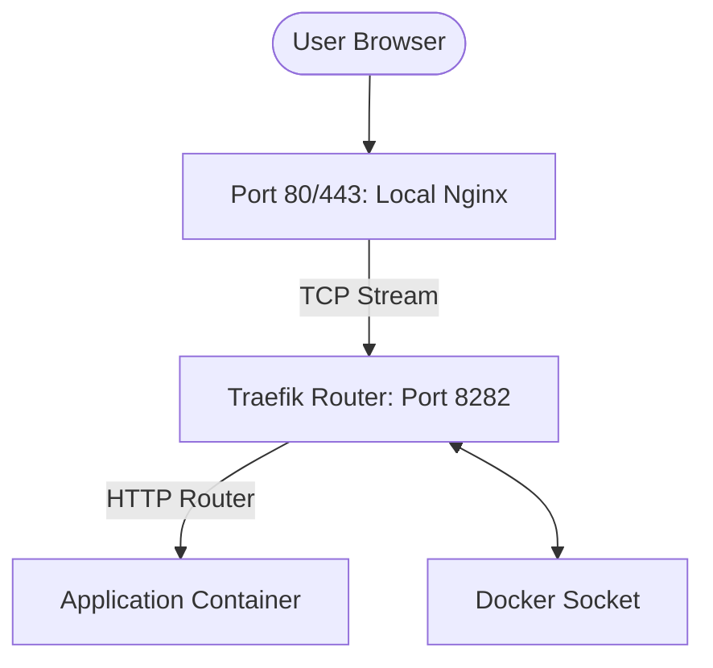

# VPSHub Hosting Architecture

This document explains the modernized hosting architecture used by VPSHub for deploying and managing services. The system leverages a dual-proxy strategy using **Nginx** and **Traefik** to provide a robust, automated, and observable environment.

## 1. Request Flow Overview

When a user visits a site hosted on VPSHub (e.g., `https://my-app.1.2.3.4.nip.io`), the request passes through multiple layers on the server:



### Layer 1: Nginx (Pre-Configured Edge)
Nginx acts as the primary "Edge Proxy" on the host machine.
- **Strict Isolation**: VPSHub **does not** modify, overwrite, or inject configuration into any Nginx files in `/etc/nginx`.
- **Pre-requisite**: Nginx must be manually configured to proxy traffic for VPSHub domains to `http://127.0.0.1:8282`.
- **Benefit**: This ensures VPSHub never interferes with existing sites or custom Nginx configurations on the server.

### Layer 2: Traefik (Internal Container Router)
Traefik is the "Brain" of the internal network, running entirely inside Docker.
- **Port Mapping**: It binds to loopback ports `127.0.0.1:8282` (HTTP) and `127.0.0.1:8443` (HTTPS). It **does not** bind to port 80 or 443 on the host.
- **No Host Network**: Traefik uses a standard Docker bridge network (`vpshub-proxy`).
- **Label-Only Discovery**: Traefik watches the Docker socket and discovers services solely through Docker labels.

### Layer 3: Application Containers
Your applications run in isolated Docker containers, often as part of a `docker-compose` project. They are connected to a shared `vpshub-proxy` network, allowing Traefik to reach them without exposing their internal ports to the public internet.

---

## 2. Deployment Automation

VPSHub automates the configuration of these layers whenever you deploy a project.

### Step 1: Naming & Context
The system extracts the project name from the GitHub repository (e.g., `user/tradovate.git` -> `tradovate`). This name is used as the **Base Identity** for domains and container names.

### Step 2: Configuration Generation
For Docker-based projects, VPSHub generates a `docker-compose.override.yml` that includes Traefik labels:
```yaml
services:
  web:
    networks:
      - vpshub-proxy
    labels:
      - "traefik.enable=true"
      - "traefik.http.routers.my-app.rule=Host(`my-app.vps-ip.nip.io`)"
      - "traefik.http.services.my-app.loadbalancer.server.port=80"
```

### Step 3: Zero-Config Discovery
As soon as `docker compose up` completes, Traefik detects the new labels and starts routing traffic to the container. There is no need to restart Nginx or Traefik manually.

---

## 3. Key Benefits

- **Isolation**: Each project has its own Docker network and isolated environment.
- **Observability**: Services are automatically mapped to ports, and their health is monitored.
- **Simplicity**: No manual Nginx `.conf` files are needed for new deployments.
- **SSL by Default**: Custom domains get automatic HTTPS via Traefik's Let's Encrypt integration.

## 4. Port Configuration (Latest Update)
To avoid conflicts with external services (like Antler Sentinel), Traefik has been moved to a unique internal port mapping:
- **Public Ports**: 80 (HTTP), 443 (HTTPS)
- **Internal Traefik Loopback**: `8282`
- **Application Ports**: Dynamically handled by Traefik load balancer labels.
